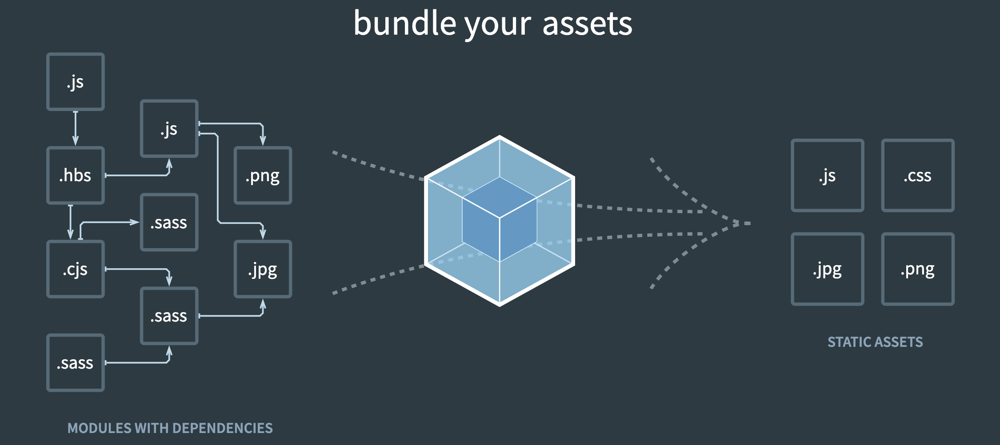
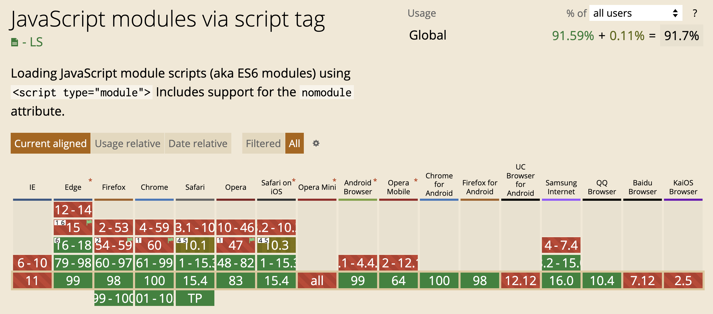
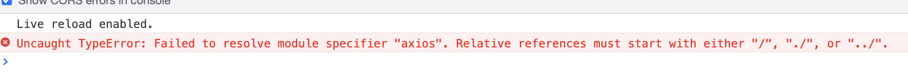
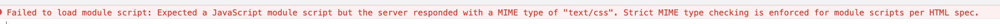
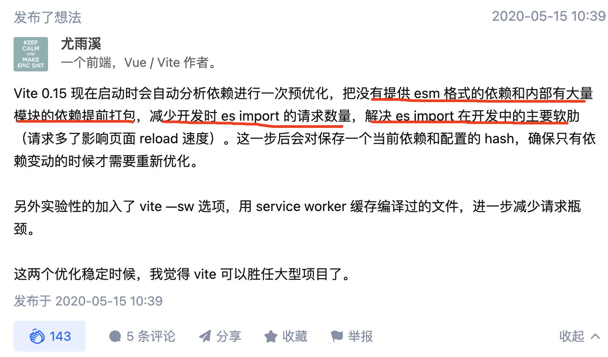

1. 分享题目

   我也能写个 vite

2. 个人简介

   我是张跑跑，一个小小的程序猿

3. 适用对象

   喜欢探索原理的前端小伙伴

4. 分享简介

   一起探索 vite 的实现原理，然后写个属于自己的下一代构建工具

5. 分享大纲

   - 构建发展史
     - 无构建
     - 全构建
     - 半构建
   - Vite 到底为什么这么 vite
     - 天时地利
     - 人和
   - 动动小拇指写起来
     - 本地服务
     - 解决依赖
     - 静态资源
     - 文件处理
   - 未完待续
     - 生成环境构建
     - 解决硬编码
     - 处理循环依赖
     - 处理多包依赖

# vite

## 0. 开场

大家好，我是张跑跑，一个程序猿，非常荣幸能够跟大家分享，知道自己本事不够，甚是忐忑，所以只得多多准备，以求不会浪费大家宝贵的时间。

我呢，是一个老爱问为什么的人，总喜欢去探究那些奇妙的东西，vite 就是其一，约莫 2020 年 9 月份开始了解到 vite，当时 vue3 也准备发布了，我就试着去尝尝鲜，给了我两个感受

1. 简直丝滑 —— vite /vit/ quick 

2. webpack 已经完成了它的历史使命 —— 用尤大21年初在知乎上的一个回答来说

   <div align='center'>
     
   </div>

当时我就去探究过 vite 的实现原理，也在团队中推动和分享过，不过当时 vite 还并不是那么为人所知。

到今天为止，vite 也到了 2.9 版本，也备受越来越多的人所喜爱

<div align='center'>
  
</div>

## 1. 构建发展史

1. 无构建时代

   在网页开发的早期，javascript 作为一种脚本语言，主做一些简单的表单验证或动画实现等，那个时候代码还是很少的。那个时候的代码是怎么写的呢？直接将代码写在`<script>`标签中即可。随着ajax异步请求的出现，慢慢形成了前后端的分离，客户端需要完成的事情越来越多，代码量也是与日俱增。为了应对代码量的剧增，我们通常会将代码组织在多个 javascript 文件中，进行维护。但是这种维护方式，依然不能避免一些灾难性的问题。比如全局变量同名问题，我们的前辈们也提出了非常多的方案，比如

   - IIFE —— 每个文件都是一个 IIFE

     这样做能解决全局变量同名问题，但也使得全局变量失效

   - 模块化 —— CJS、AMD 和 ESM

     能够解决所有的问题也是行业的标准做法，但咱们的 javascript 从一出生就没考虑过原来自己能成长到如此地步，也就是说，它天生就不支持模块化

2. 全构建时代

   既然  javascript 底层不支持，那就借助于工具。模块化开发，然后经过工具处理，处理成能够在 js 引擎上运行的代码。那么工具处理这一过程，也就是常说的打包

   > 大部分情况下 js 是运行在浏览器中，因此，为了便于撰写和阅读，下文将能够运行 js 代码的引擎统称为浏览器

   <div align='center'>
     
   </div>

   2012 年 3 月10 号，这可是个伟大的日子，Tobias  创造了 webpack，也标志着前端进入模块化开发的时代，这里我称它为全构建，为何如此。

   > 前端构建工具不止 webpack，但它是最受欢迎的，因此，为了便于撰写和阅读，下文构建工具统称为 webpack

   因为，不论是开发环境还是生成环境，只要是模块化开发，代码都需要经过 webpack 构建才能在浏览器中展现。

   webpack 几乎完美的支持了前端模块化开发，也提出了非常多的创新，比如 HMR，但 webpack 有一个无法解决的问题，即大型项目构建缓慢，特别是在开发时，面临一个大型的项目，启动时花费 5 - 10 分钟非常常见（M1 阔能要快点），相信下面这张图大家非常熟悉。

   <div align='center'>
     
   </div>

   我其实开发时还能忍受，先 yarn dev 起，然后再去干一些其它的事情，约莫着应该好了，再回过头来开始开发。但社区的大佬们不答应了，分分钟几千万上下，让我们等，可怎么行，于是我们又来到了下一个时代

3. 半构建时代

   半构建 —— 开发时无构建，生产环境构建。

## 2. Vite 到底为什么这么 vite

Vite

Vite /vit/ quick fase

开发时无构建过程

### 2.1 天时地利

得益于浏览器支持 ESM，使得 javascript 在一定程度上支持了模块化

<div align='center'>
  
</div>

<div align='center'>
  
  
</div>

由此可以看到，开发时并不需要构建的过程

### 2.2 人和

虽然主流的浏览器支持了 ESM，但还远远无法满足项目模块化开发的需求，还存在很多的问题：

1. 不支持三方依赖

<div align='center'>
  
</div>

<div align='center'>
  
</div>

​	从第三方库中引入方法就会引发错误。

2. 仅支持 “application/javascript” 文件

   > 这里的 “application/javascript” 是指从服务端返回的 **Content-Type**，并不指文件本身的格式，下文为了方便，统称为 js 文件

   浏览器仅支持 import MIME 为 “application/javascript”  的文件，一旦遇到其它格式的文件，它便无法处理了，例如 css 文件

   <div align='center'>
     
   </div>

3. 浏览器仅支持标准格式

   其实不仅仅是 import 不支持除 js 外的其它文件，浏览器本身就仅仅认识 html, css, js, jpg, mp4 等标准格式的文件，一旦遇到其它格式的文件，即便是 import 支持引入，浏览器也无法处理，比如 jsx、scss 

   > 浏览器仅支持标准文件是十分合理的，这里只是提出，在纯浏览器下实现模块化开发存在的问题

如果能够解决这些问题，再充分地利用浏览器支持 ESM 这一特性，就完全可以实现开发时无构建。

 vite 就是完美的解决了这些问题，实现了开发时无需构建的效果


总结：

1. 浏览器支持基本的 ESM 
2. vite 基于原生 ESM 提供丰富的内建功能


## 3. 动动小拇指写起来

- 原生 ESM

  当 `script` 标签中添加 `type = module` 时， 可以支持 js 中 `import` 语法，比如

  ```js
  import { alertMsg } from "./alertMsg.js" 
  ```

  就会发起一个网络请求

  <div align='center'>
    
  </div>

  既然每一个 import 都会发起一个网络请求，也就是向服务器要东西，那家伙服务器就可以做很多东西了，你不是只能接收 js 文件嘛，我把啥都给你转成 js

- 本地服务

  起一个本地服务，浏览器就向本地服务器要东西呗，好咧， vite 是基于 Koa 做底层服务器的，我们也搞起

  - 返回 html 文件

    ```js
    const Koa = require("koa");
    const fs = require("fs");
    const app = new Koa();
    
    app.use((ctx) => {
      const html = fs.readFileSync("./index.html", "utf-8");
      ctx.type = "text/html";
      ctx.body = html;
    });
    
    const port = 6090;
    app.listen(port, (err) => {
      if (err) throw err;
      console.log(`app start at ${port}`);
    });
    ```

  - 返回 `import` 文件

    ```js
      const { url } = ctx.request;
      if (url === "/") {
        const html = fs.readFileSync("./index.html", "utf-8");
        ctx.type = "text/html";
        ctx.body = html;
      } else {
        const js = fs.readFileSync(path.join(__dirname, url), "utf-8");
        ctx.type = "application/javascript";
        ctx.body = js;
      }
    ```

    

- 解决依赖

- 静态资源

- 文件处理




webpack 从 2012 年诞生以来，陪伴我们 10 年了，


https://zhuanlan.zhihu.com/p/424842555


https://v8.dev/features/modules#mjs
